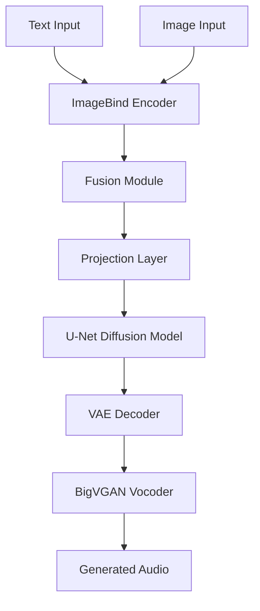
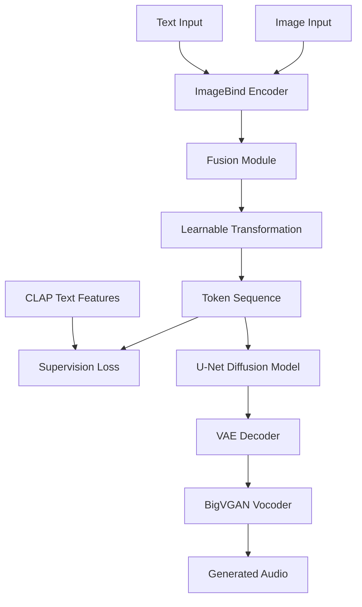
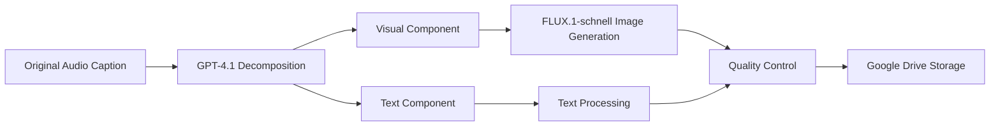

# 🏗️ Architecture Documentation

## System Overview

The Unified Multimodal Framework integrates three key components to enable text and vision guided audio generation:

1. **ImageBind Integration**: Unified multimodal embedding space
2. **Make-An-Audio Foundation**: Base text-to-audio generation
3. **Automated Data Pipeline**: Multimodal dataset creation

## 🔬 Experimental Design

### Experiment A: Direct Replacement Strategy



**Components:**
- **ImageBind Encoder**: Processes both text and image inputs (1024-dim embeddings)
- **Fusion Module**: Simple averaging of text and image embeddings
- **Projection Layer**: Maps fused embeddings to U-Net conditioning space
- **Two-stage Training**: Projection training → End-to-end fine-tuning

### Experiment B: CLAP Alignment Strategy



**Key Innovations:**
- **Token Sequence Approach**: Transforms fused embeddings into token sequences
- **CLAP Supervision**: Uses CLAP-encoded features as ground truth
- **Combined Loss Function**: MSE + Cosine Similarity

## 🤖 Automated Data Generation Pipeline



**Pipeline Stages:**
1. **Semantic Decomposition**: Split captions into visual (3-7 words) and text (3-7 words) components
2. **Image Generation**: Generate high-quality images from visual components
3. **Quality Control**: Ensure zero overlap between components
4. **Automated Storage**: Systematic organization with consistent naming

## 📊 Model Architecture Details

### ImageBind Integration

```python
# ImageBind processing pipeline
def process_multimodal_input(text, image):
    text_embedding = imagebind.encode_text(text)  # [1, 1024]
    image_embedding = imagebind.encode_image(image)  # [1, 1024]
    
    # Simple averaging fusion
    fused_embedding = (text_embedding + image_embedding) / 2
    
    return fused_embedding
```

### CLAP Alignment Training

```python
# Combined loss function for Experiment B
def compute_alignment_loss(predicted_tokens, clap_features):
    mse_loss = F.mse_loss(predicted_tokens, clap_features)
    cosine_loss = 1 - F.cosine_similarity(predicted_tokens, clap_features)
    
    total_loss = 2.0 * mse_loss + 1.0 * cosine_loss
    return total_loss
```

## 🎯 Training Configuration

### Experiment A Configuration

```yaml
# Two-stage training strategy
stage_1:
  learning_rate: 1e-4
  frozen_modules: [imagebind, unet]
  trainable_modules: [fusion, projection]
  epochs: 25

stage_2:
  learning_rate: 1e-5
  frozen_modules: [imagebind]
  trainable_modules: [fusion, projection, unet]
  epochs: 25
```

### Experiment B Configuration

```yaml
# Extended training for alignment
training:
  learning_rate: 1e-5
  epochs: 100
  loss_weights:
    mse: 2.0
    cosine: 1.0
  batch_size: 4
```

## 🔧 Key Design Decisions

### 1. Fusion Strategy Selection
- **Simple Averaging**: Outperformed weighted and attention-based fusion
- **Reason**: Limited dataset size; complex mechanisms require more data

### 2. Embedding Space Alignment
- **Challenge**: ImageBind and CLAP embedding spaces not inherently aligned
- **Solution**: Learnable transformation with supervision (Experiment B)

### 3. Training Stability
- **Problem**: Direct replacement caused unstable convergence
- **Solution**: Incremental alignment approach with existing CLAP space

## 📈 Performance Analysis

### Convergence Patterns

| Aspect | Experiment A | Experiment B |
|--------|--------------|--------------|
| Initial Loss | High variance | Rapid convergence (5-6 epochs) |
| Training Stability | Unstable | Stable |
| Validation Gap | Large | Moderate |
| Final Performance | Poor | Limited but functional |

### Memory Requirements

- **GPU Memory**: 16GB (RTX 4090)
- **Batch Size**: 4 (memory constrained)
- **Model Size**: ~2.3B parameters (ImageBind + U-Net)

## 🔍 Architectural Insights

### Success Factors (Experiment B)
1. **Compatibility Preservation**: Maintained CLAP representation space
2. **Supervised Learning**: Clear learning target through CLAP features
3. **Incremental Approach**: Built upon existing stable architecture

### Failure Analysis (Experiment A)
1. **Embedding Mismatch**: ImageBind vs CLAP space incompatibility
2. **Complex Optimization**: Simultaneous feature mapping and audio generation
3. **Insufficient Data**: Limited samples for complex cross-modal learning

## 🚀 Implementation Notes

### Environment Setup
- **ImageBind**: Python 3.10, PyTorch 2.0+
- **Make-An-Audio**: Python 3.8, specific dependency versions
- **Hardware**: CUDA-compatible GPU, 16GB+ VRAM

### Critical Dependencies
```python
torch>=2.0.0
transformers>=4.20.0
diffusers>=0.20.0
librosa>=0.9.0
soundfile>=0.10.0
```

## 📚 References

- **ImageBind**: "ImageBind: One Embedding Space To Bind Them All" (Meta, 2023)
- **Make-An-Audio**: "Make-an-audio: Text-to-audio generation with prompt-enhanced diffusion models" (ICML 2023)
- **CLAP**: "CLAP: Learning Audio Concepts From Natural Language Supervision" (2022)
- **Latent Diffusion**: "High-Resolution Image Synthesis with Latent Diffusion Models" (CVPR 2022)